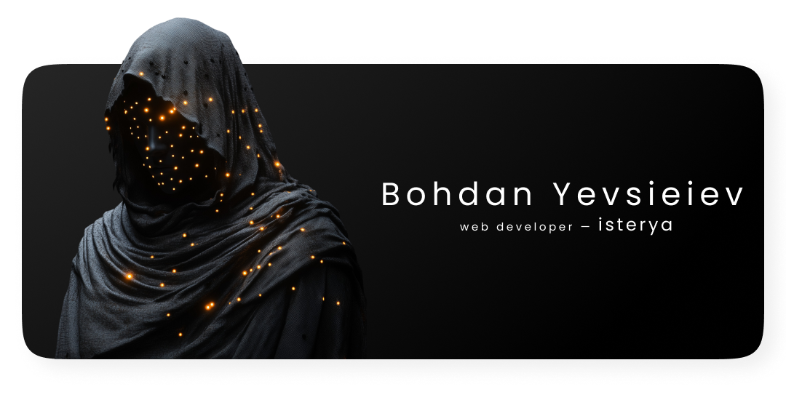

I'm 18 years old and have over two years of hands-on experience building modern, scalable web applications with React, TypeScript, and a robust front-end architecture. I prioritize clean code, thoughtful design, and continuous self-improvement.

---

## 🚀 Tech Stack

- React / Redux Toolkit / Next.js
- TypeScript / JavaScript (ES6+)
- Tailwind CSS / SCSS / Styled Components / Stylelint
- Clean architecture (including Feature-Sliced Design principles)
- Git / GitHub / ESLint / Webpack / Vite

---

## 💼 Projects

[isterya.dev](https://www.isterya.dev/) — my personal portfolio  
30+ projects completed  
Currently working on a full-featured quiz app with user accounts, progress tracking, and dynamic logic — coming soon!

---

## 📫 Contact Me

- Telegram: [@perfectn1ght](https://t.me/perfectn1ght)
- Resume: [View PDF](https://drive.google.com/file/d/1KIwPtCVCfr7uzwX1EYivj9Y_yJhQpLX-/view?usp=sharing)

---

> 💬 Thank you for your attention! My social networks are always open for collaboration
