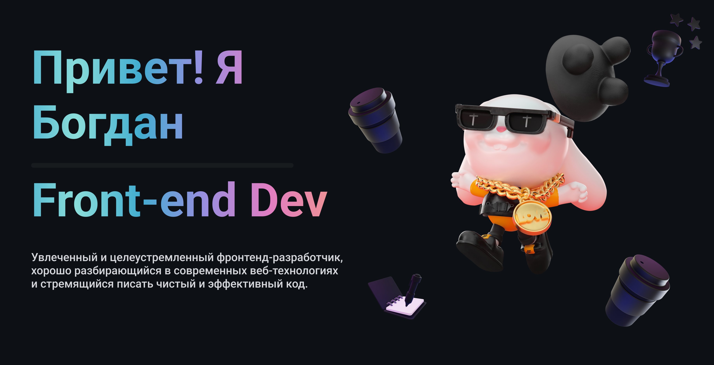

<!DOCTYPE html>
<html lang="en">
   <head>
      <meta charset="UTF-8" />
      <meta name="viewport" content="width=device-width, initial-scale=1.0" />
   </head>
   <body>
      

         

          
         

         <h1 align="center">Привет, меня зовут Богдан!</h1>
         

            Я активно занимаюсь разработкой во фронтенде. Постоянно стремлюсь к самосовершенствованию и расширению своих
            знаний.
         

         <h2 align="center">Обо мне</h2>
         

            Я студент с высокими амбициями и страстью к фронтенд-разработке. Моя цель — постоянно повышать свой уровень
            знаний и быть востребованным на рынке труда. Я стрессоустойчив, коммуникабелен и умею эффективно работать в
            команде.
         

         <h2 align="center">Мои навыки</h2>
         <ul align="center">
            <li><b>JavaScript</b> и <b>TypeScript</b></li>
            <li>Фреймворк <b>React</b></li>
            <li>Продвинутые знания <b>HTML</b> и <b>CSS</b></li>
         </ul>
         <h2 align="center">Связь со мной</h2>
         
Мой личный аккаунт в Telegram: @perfectn1ght

         
Мой сайт-портфолио: https://purrcode.ru/

      

   </body>
</html>
